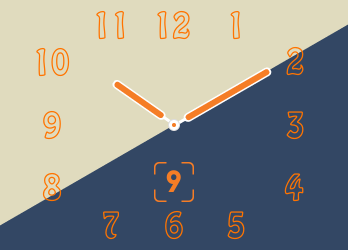
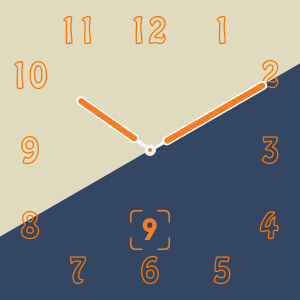

# Mock Hermes Watch

Fitbit Clock Face like a Apple Watch Hermès

|Ionic|Versa|
|:---:|:---:|
|||

[Store Link](https://gam.fitbit.com/gallery/clock/50d69af9-f680-4f73-aad4-2f7b0c30dafc)

## Requirement
### Local
- Node.js 8.+

### Fitbit Studio
- Don't need anything!

## Build
### Local

```sh
$ git clone git@github.com:sakebook/mock-hermes-watch.git
$ cd mock-hermes-watch
mock-hermes-watch$ npm install
mock-hermes-watch$ npx fitbit
fitbit$ build
fitbit$ install
```

### Fitbit Studio
```sh
$ git clone git@github.com:sakebook/mock-hermes-watch.git
```

and D&D `app/`, `resources/`, `package.json`

